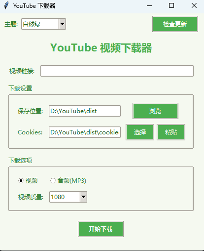

# YouTube 下载器

一个简单易用、界面美观的 YouTube 视频下载工具。支持视频和音频下载，提供多种主题切换，支持自定义 cookies。

## 主要特点

### 界面设计

- 五种精美主题：
  - 深色现代
  - 浅色简约
  - 科技蓝
  - 暗夜紫
  - 自然绿
- 简洁直观的用户界面
- 实时下载进度显示
- 响应式设计

### 核心功能

- 支持视频和音频下载
- 视频质量选择（2160p/1440p/1080p/720p/480p）
- 音频转换为 MP3 格式
- cookies 支持（支持文件导入和直接粘贴）
- 自动检查更新
- 自动下载和配置 FFmpeg

## 使用说明

1. 下载和运行

   - 直接运行 `YouTube下载器.exe`
   - 程序会自动检查并下载所需组件

2. 视频下载

   - 复制 YouTube 视频链接
   - 粘贴到程序的链接输入框
   - 选择下载格式（视频/音频）
   - 选择视频质量（仅视频模式）
   - 点击"开始下载"

3. Cookies 设置（可选）

   - 方法一：使用浏览器扩展（如 Get cookies.txt）导出 cookies 文件
   - 方法二：直接复制 cookies 内容，使用粘贴功能
   - 设置 cookies 可以下载会员视频（需要登录账号）

## 注意事项

1. 系统要求

   - Windows 操作系统
   - 稳定的网络连接

2. 常见问题

   - 如果下载失败，请检查网络连接
   - 会员视频需要正确的 cookies
   - cookies 可能会定期失效，需要重新获取

3. 隐私提示

   - 本程序不会收集任何个人信息
   - cookies 文件仅用于视频下载，请勿分享给他人

## 技术支持

如果遇到问题或需要帮助，请：

1. 检查是否是最新版本
2. 使用"检查更新"功能更新组件
3. 确保 cookies 文件格式正确（如果使用）

## 免责声明

本程序仅用于个人学习和研究。请遵守 YouTube 服务条款和版权法律，不要下载受版权保护的内容。使用本程序产生的任何法律责任由用户自行承担。

## 致谢

本项目使用了以下开源组件：

- yt-dlp
- FFmpeg
- Python Tkinter

感谢这些优秀的开源项目！
